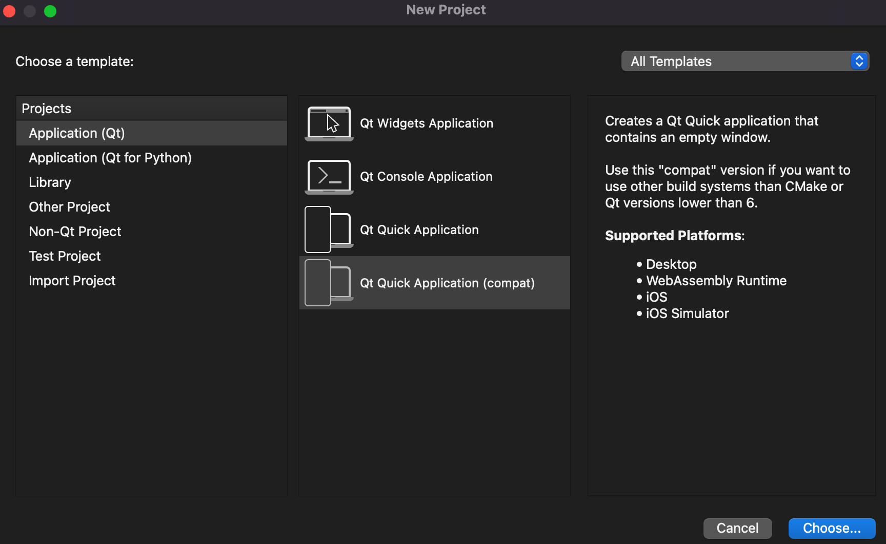
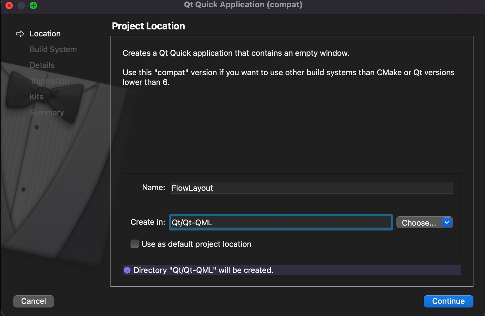
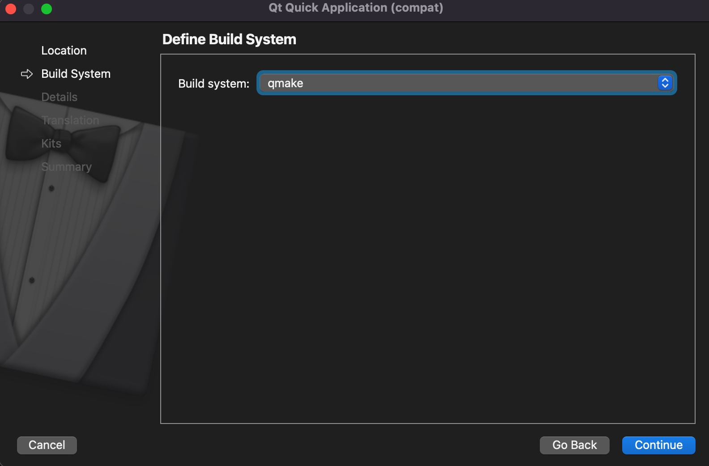
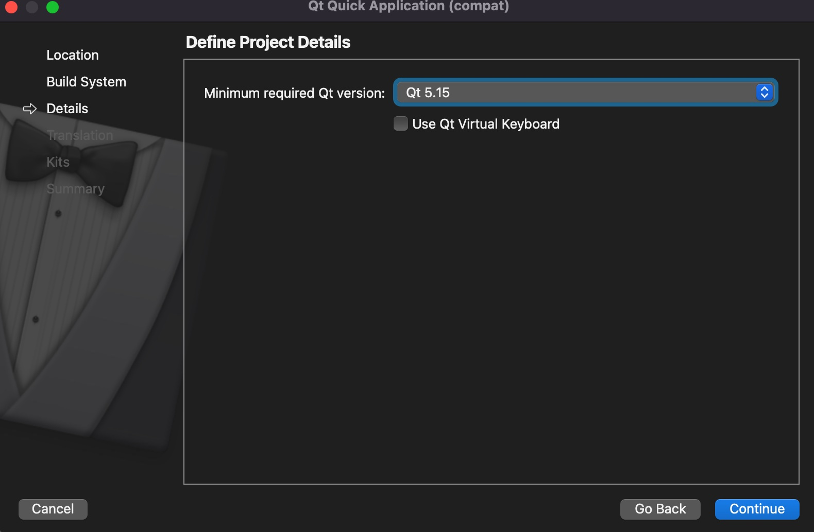
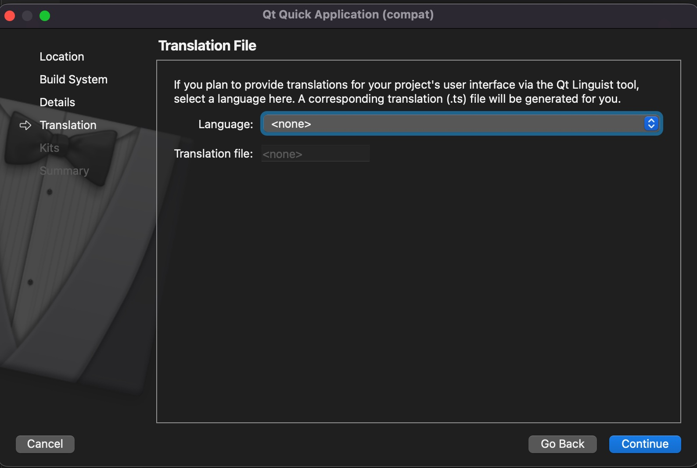
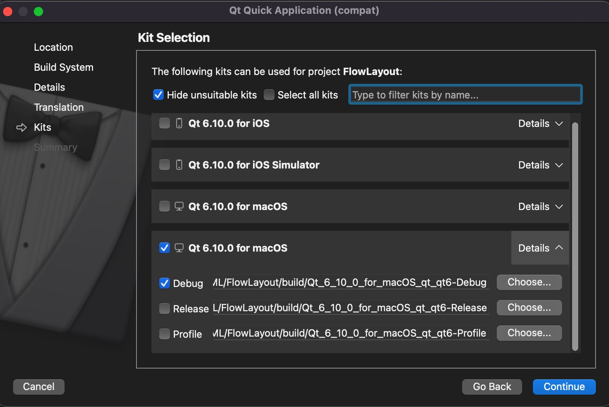
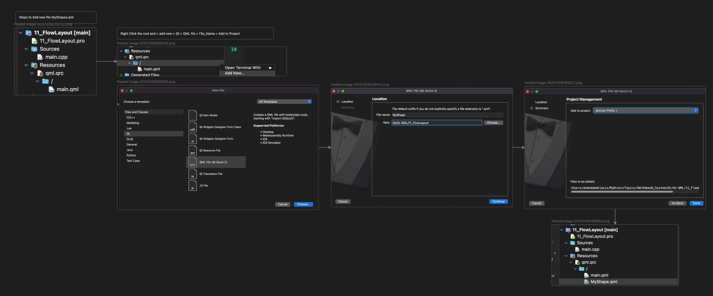

## 🛠️ Prerequisites

- **Qt SDK**: Qt 5.15.0 or newer  
- **Build System**: `qmake` or `CMake`  
- **C++ Compiler**: MSVC / MinGW / GCC / Clang (any Qt-supported, C++17-compatible compiler)

---

## ⚙️ Building and Running

### 1. Creating the Project in Qt Creator

To avoid common resource-path issues, and to be able to run my examples or create like them, please follow the creation steps or make sure to run against same Qt SDK version 5.15.

1. Open **Qt Creator** and go to  
   `File → New File or Project → Application (Qt) → Qt Quick Application`.
   

2. Name your project (for example, `FlowLayout`).  
   > Note: Renaming the project later is non-trivial, so choose carefully.
   

3. Choose your **Build System**: `qmake` or `CMake`.
   

4. Select the **Minimum required Qt version** (for example, Qt 5.15).
   
   

5. Select the **Kits** for your target platforms (for example, Desktop, Android).

   

6. Finish the wizard. It will:
   - Create the project files (`.pro` or `CMakeLists.txt`)
   - Generate a `main.cpp`
   - Generate a starter `main.qml`

    

---

### 2. Adding Custom Components

When adding a new QML file (for example, `MyShape.qml`)
Follow these steps:

---

### 3. Build and Execute

1. Open the project in **Qt Creator**.
2. Select your desired **Kit** (for example, *Desktop (Debug)*).
3. Click the **Run** button (green arrow) or press:
   - `Ctrl + R` on Windows/Linux  
   - `Cmd + R` on macOS

---

### 4. Best Practice: Separate UI and Logic

- **QML is for UI (Front End)**  
  Use QML for:
  - Visual scene and layout
  - Animations and state transitions
  - Handling user input (mouse, touch, keyboard)

- **C++ is for logic (Back End)**  
  Use C++ (`QObject`-based classes) for:
  - Complex or performance-critical logic
  - Data processing and models
  - Networking and I/O
  - Business rules and domain logic

---

## 💡 Examples

### Example 1: Custom Draggable Component

- **File**: `QML/components/MyShape.qml`  
- **Purpose**:  
  A reusable `Rectangle` component with a `MouseArea` for dragging.  
  Demonstrates:
  - Encapsulation of behavior in a single QML file  
  - Exposing properties (e.g. `color`, `radius`) for customization from the outside  

### Example 2: Flow Layout Demo

- **File**: `QML/main.qml`  
- **Purpose**:  
  Demonstrates using the `Flow` type to automatically arrange child components, avoiding absolute/fixed positioning and improving responsiveness across different window sizes.

---

## 🎥 Video Tutorial

For a visual walkthrough of creating a basic Qt Quick application using QML, see:

[Create a Qt Framework Application Using QML & Qt Quick SDK](https://www.youtube.com/watch?v=MwmlNflt8G0)
